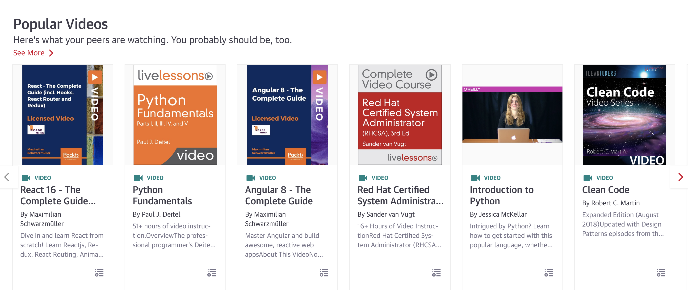
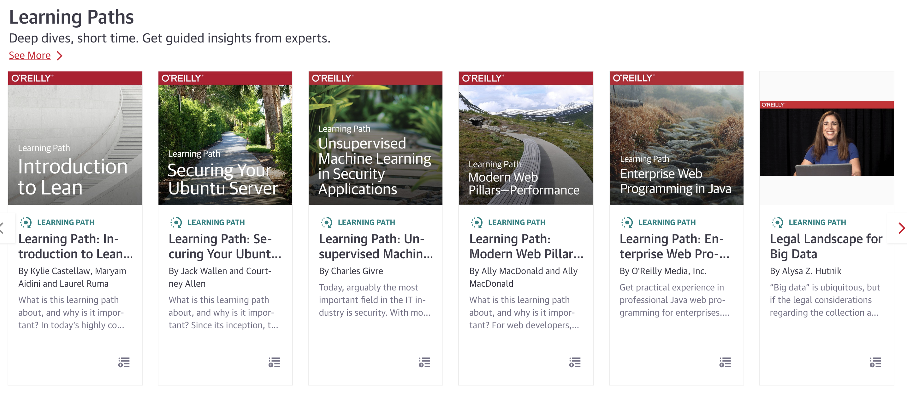
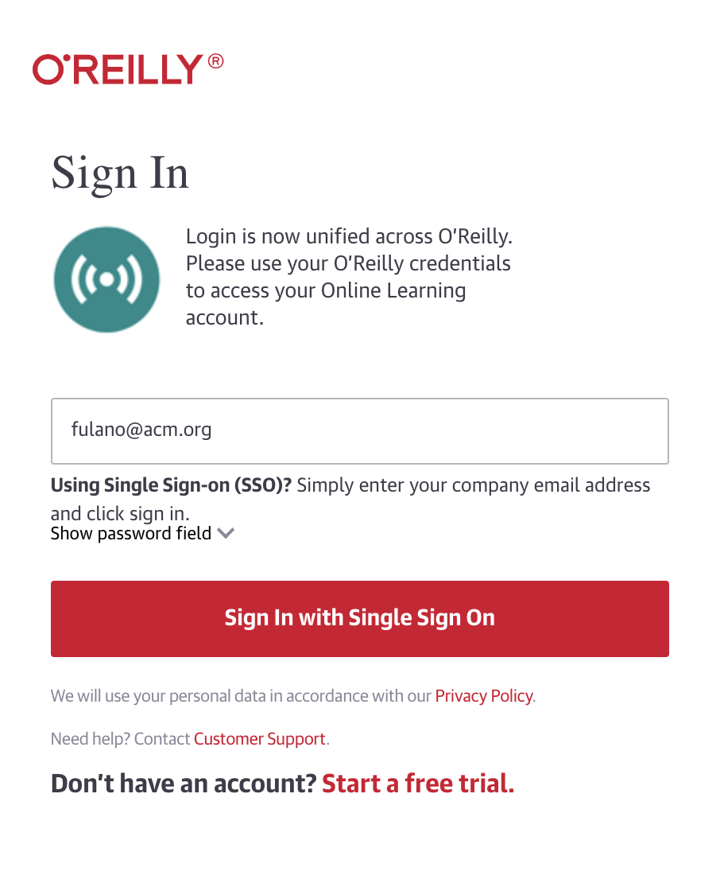

Eu AMO o meu Brasilzão, sério mesmo, apesar dos pesares é minha casa e amo o meu povo. Uma das coisas que mais sinto falta por aqui é conteúdo técnico de qualidade, tem muita gente incrível escrevendo coisas e criando conteúdo mas ainda sofremos de uma deficiência grande quando falamos em livros ou cursos de qualidade.

Se você trabalha com tecnologia sabe que as coisas acontecem numa velocidade absurdamente rápida, é praticamente impossível traduzir e publicar todo esse conteúdo na mesma velocidade. O que nos leva a necessidade de comprar os livros em inglês e o problema maior nessa equação é o preço. Comprar esses livros na velocidade dos lançamentos vai te falir rapidinho. :sos: 

E se... alguém criasse um spotify de livros? 

Tem muita gente fazendo isso por aí, mas cada editora faz o seu e disponibiliza seu conteúdo lá. Legal, mas aí vamos cair no mesmo problema do netflix, amazon, hbo, hulu, apple... você pegou a ideia.

A O'reilly, famosa editora de livros com os bichinhos na capa, tem sua própria plataforma chamada [safari books online](https://en.wikipedia.org/wiki/Safari_Books_Online). Mas a diferença é que além dos títulos próprios a plataforma disponibiliza várias outras editoras famosas como Manning Publications, famosa pela sere In Action, Addison-Wesley, Adobe Press, Cisco Press, Focal Press, FT Press, IBM Press,
John Wiley & Sons, Microsoft Press, Packt, Peachpit, Prentice Hall, e SAS Institute. Além dos livros eles possuem: 

Live Trainings: 

Videos:

Learning Paths:

E até casos de uso:

Show... fiz o pitch do safari, mas meu objetivo não é apenas esse. Quero que você use essa plataforma maravilhosa, mas... o preço é um pouco salgado demais para nós PTB Rs.

A boa notícia é que é possível ter acesso a plataforma por um precinho mais camarada. Tudo que você precisa é se associar a [ACM](https://www.acm.org/). A ACM é a [primeira sociedade científica e educacional dedicada à computação](https://pt.wikipedia.org/wiki/Association_for_Computing_Machinery) e eles possuem um plano especial: [for individuals in economically developing countries](https://www.acm.org/membership/special-member-rates-developing-countries).

Através deste [link](https://services.acm.org/public/qj/proflevel/proflevel_control.cfm?level=2&country=Brazil&form_type=Professional&promo=LEVEL) você pode associar-se a ACM por 30 dólares, o plano mais básico que já te dará acesso ao safari. A partir daí, como associado você terá um email da acm: fulano@acm.org e usando esse email magico você poderá acessar o Safari.

Espero que vocês curtam e aprendam bastante.

That's all folks!

